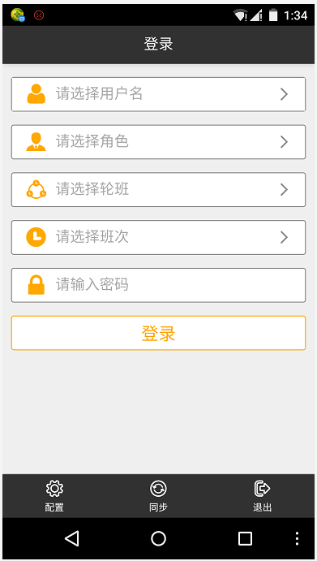
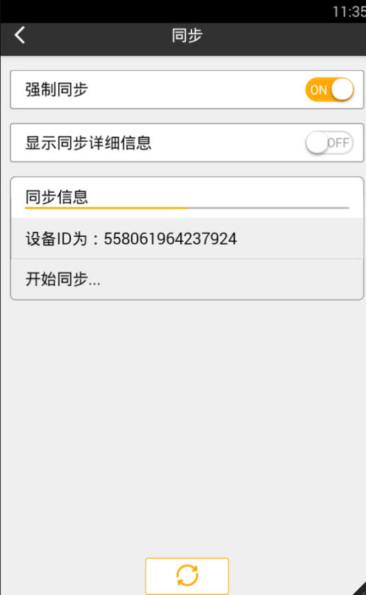
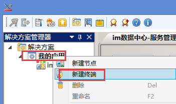
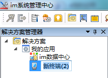
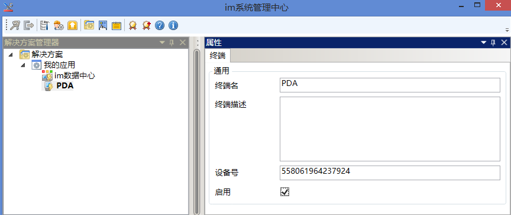

# 添加安卓终
* 将安装光盘中**imMW**文件夹下**imMW.apk** 文件拷贝至安卓设备的存储器。
* 在安卓设备中运行此安装程序。
* 运行**im移动工作站**软件，点击**同步**→开始，如下图，获取**设备ID号**。

  

  

* 选中我的应用右击→**新建终端**

  

  

* 选中新建终端（2），在右边属性框将**终端名**改为：PDA，将**设备ID**输入到**设备号**，勾选**启用**，如下图：

  