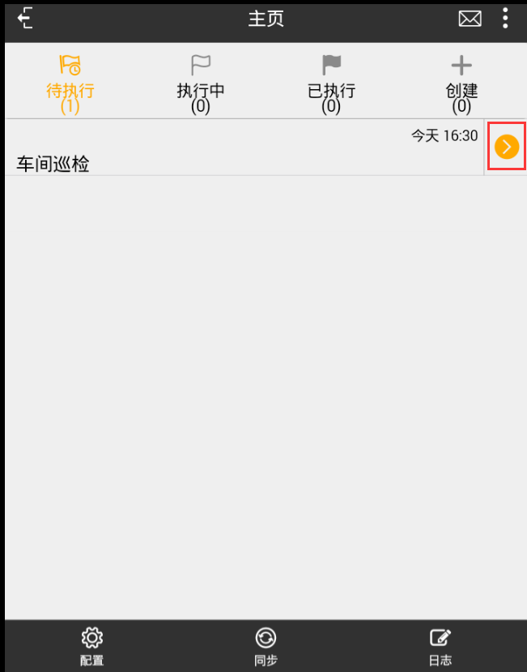
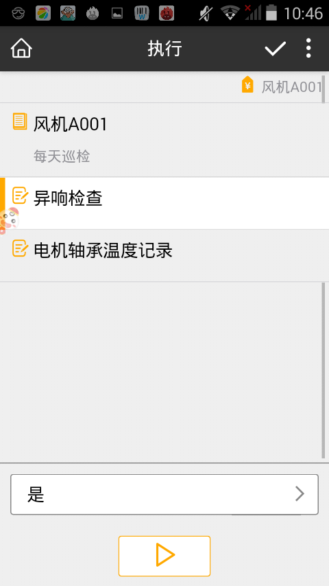
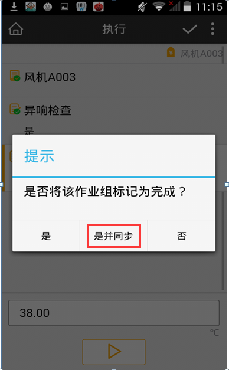
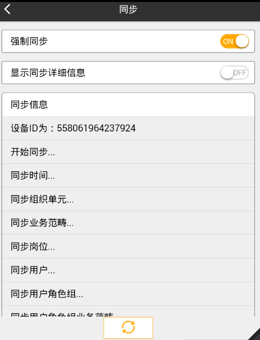

# 执行车间巡检
* 同步后进入作业组窗口，选择“车间巡检”，单击下方工具栏执行该作业组。

  

* 进入作业组后，点击下方工具栏    “下一步”按钮进入到作业页面，再次点击  “下一步”进入到作业项页面。

* 在作业项异常检查选择：是，电机轴承温度记录36℃,如图：

  

* 填写完成后选择  “下一步”，作业组已经完成了最后一步，系统跳出对话框，选择是并同步。

  

  * 是并同步：作业组标记已经完成，并同步上去
  * 是： 作业组标记城已完成，并没有同步上去，需要手动点同步按钮

  