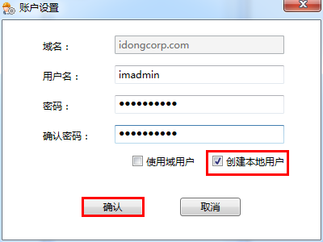

# 设置系统账户
系统帐户用于进行部署和服务的管理。该帐户应该对系统的每一个计算机节点具备管理员权限。该帐户可以是域帐户（如果你的系统部署在Windows域中）。也可以是本地帐户（不论是域环境还是工作组环境），用户应该为系统中的每一个节点配置该帐户。
再次进入SMC，如下点击SMC工具栏账户设置按钮，弹出**账户设置**配置窗口。

  

请如下进行im账户的配置：
* **域名**：不使用域用户时请忽略，使用域用户时请确认域名正确。
* **用户名**：拥有管理员权限的用户名。
* **密码**：该用户的密码。
* **确认密码**：当使用创建本地用户功能时，再次输入新用户的密码。

  

* **使用域用户**：当使用域账户时勾选此选项。
* **创建本地用户**：需创建新的本地用户时勾选此选项。系统将根据用户名和密码创建一个新的本地管理员组用户。
单击选择我的应用→**im数据中心**

  