# 配置新建业务流程
* 在右侧属性栏如下配置新建流程：

  * **流程名**：巡检
  * **流程描述**：该流程应用于车间巡检
  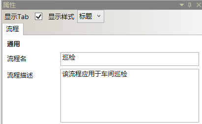

* 在导航栏→**业务流程管理器**内选择我的流程右键快捷菜单选择配置或鼠标左键双击我的流程，在主工作区出现我的流程配置页面。
  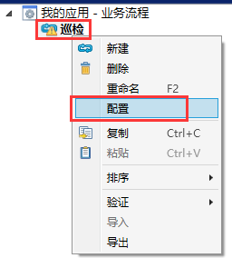
   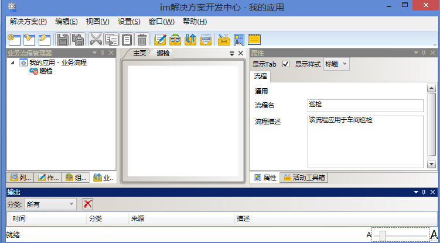

* 在属性栏→活动工具箱选项卡内，按住鼠标左键选中“开始”活动块将之拖进主工作区→我的流程配置页面，看到光标呈，松开鼠标左键放置“开始”活动块 。

  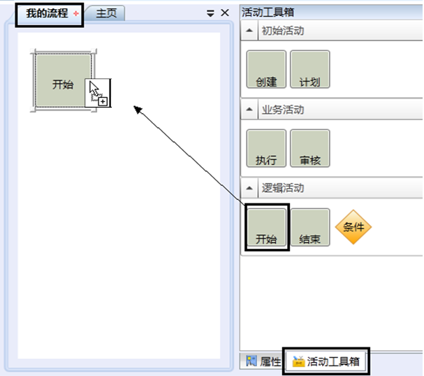

* 参照以上步骤，再依次放置“计划”、“执行”、“结束”三个活动块。如下图：
  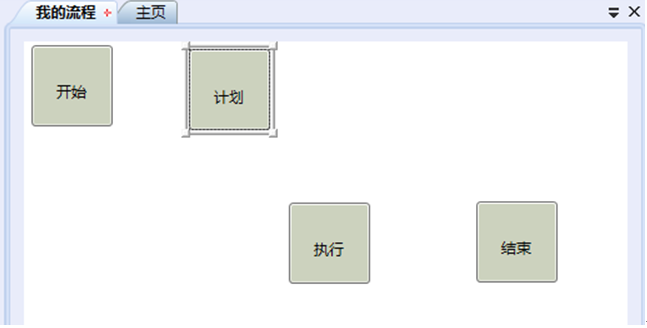

* 在主工作区→我的流程配置页面内，将光标停驻在“开始”活动块边线中点处的小方格，看到光标及活动块呈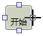，按住鼠标左键，拖动黑色十字光标至“计划”活动块边线中点小方格处，看到光标及活动块呈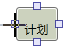，松开鼠标左键，活动块间出现箭头线将两个活动块连接。

  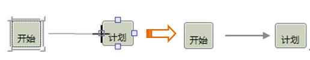

* 参照以上步骤依次连接“计划”-“执行”、“执行”-“结束”。
为“计划”和“执行”活动块指定人员。
选中“计划”活动块，在右侧属性栏配置如下图：

  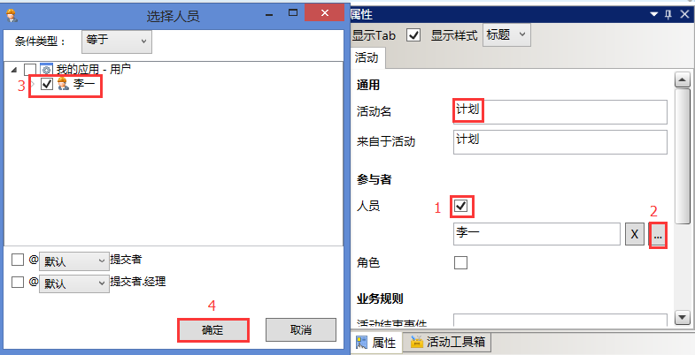

* 配置完成后如下图：
  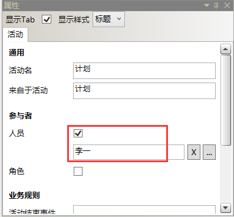

* 相同步骤为“执行”活动指定王明为执行人。
配置完成后如下图：
  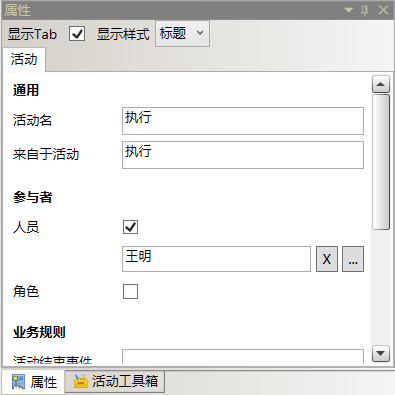

* 相同步骤为“执行”活动指定李一为审核人。
配置完成后如下图：
  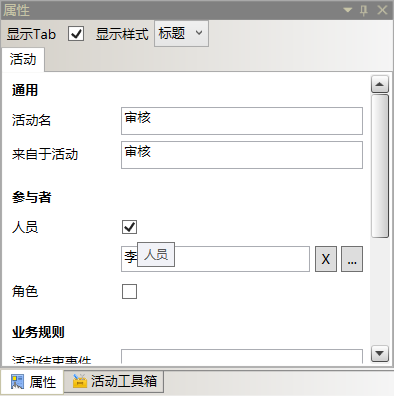

* 单击工具栏保存，完成我的流程配置。

  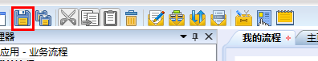