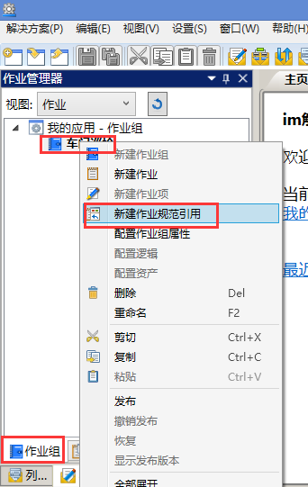
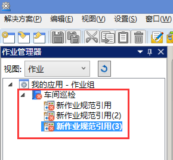
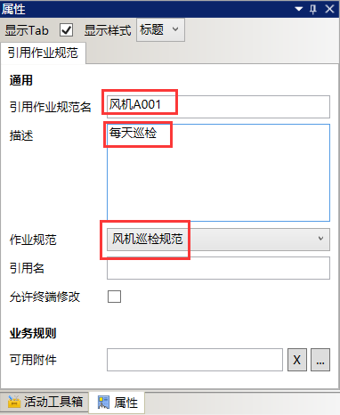
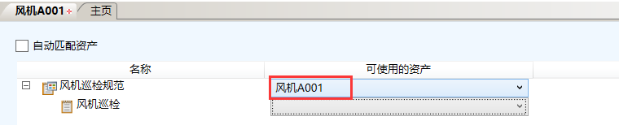
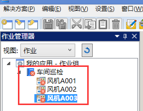

# 新建作业规范引用
* 选中“车间巡检”作业组，右击，在快捷菜单栏中选择**新建作业规范引用**（重复三次），如图：

    

    

* 选中“新建作业规范引用”，在右边属性栏修改如下图：

    

* 选中“风机A001”，右击，在快捷菜单栏中选择**配置资产**，选择资产如下图：

    

* 配置晚上后保存并关闭。

* 按照以上步骤配置其他，注意配置对应资产（略），如图：

    
