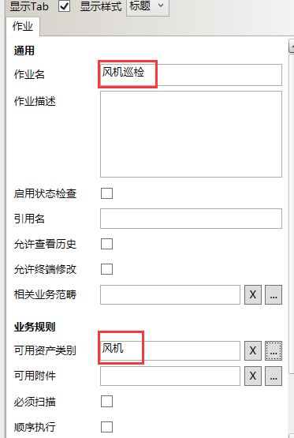
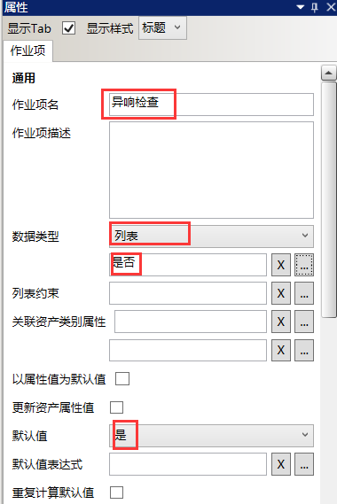
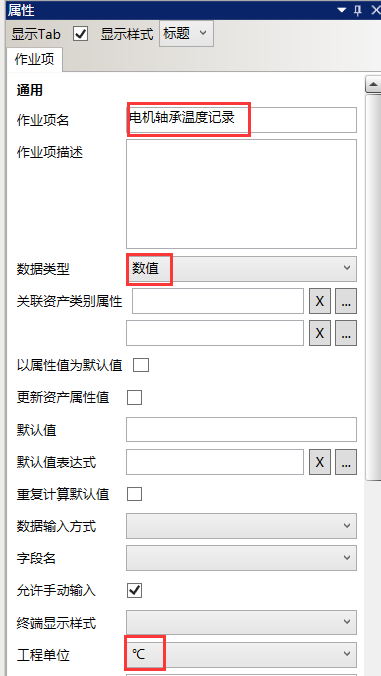

# 作业规范的配置
* 选中“新建作业规范”在右边属性栏，修改作业规范名为：风机巡检，可用资产类别为：风机，如图：
  

* 在“风机巡检”作业规范下新建一个名为“异响检查”的作业项，数据类型为：列表，列表名为：是否，默认值：是，其他项默认缺省值（无需配置）。

  

* 在“风机巡检”作业规范下新建一个名为“电机轴承温度记录”的作业项，数据类型为：数值，单位为：℃，其他项默认缺省值（无需配置）。

  