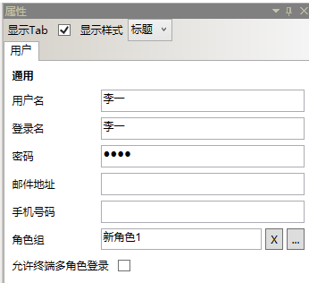
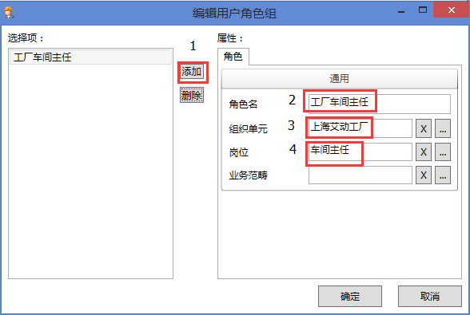
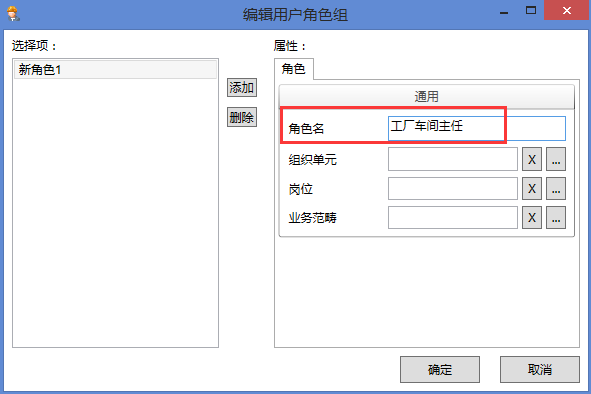
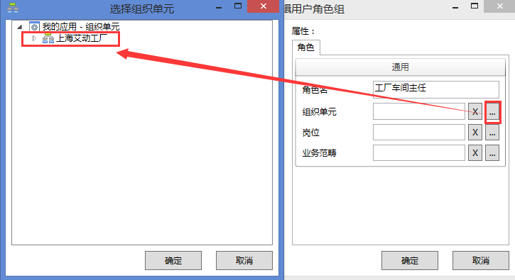
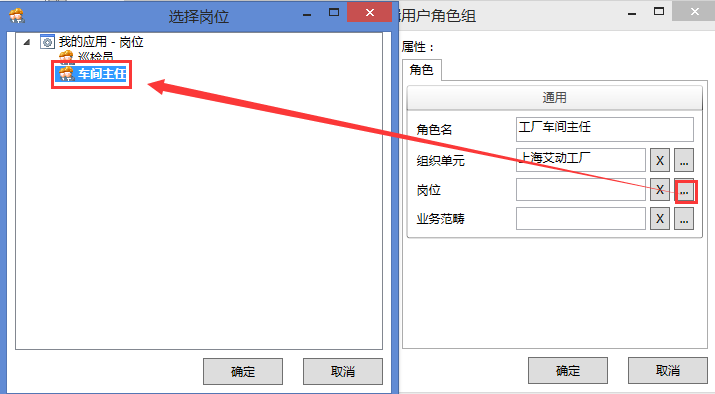

# 新建用户
* 选择新建用户，在右侧属性栏，用户配置窗口内，如下配置：

  * 用户名：李一

  * 登录名：李一

  * 密码：1234（缺省）

    

  * 角色组：工厂车间主任

* 单击 进入编辑用户角色组，如图配置

  

  * 点击**添加**
  * **角色名**：工厂车间主任
    
  * **组织单元**：上海艾动工厂
      
  * **岗位**：车间主任
      
  * **业务范畴**：空
  * **确定**。