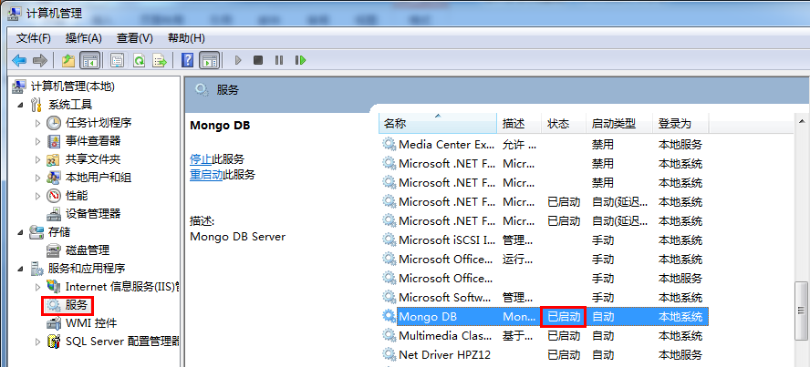
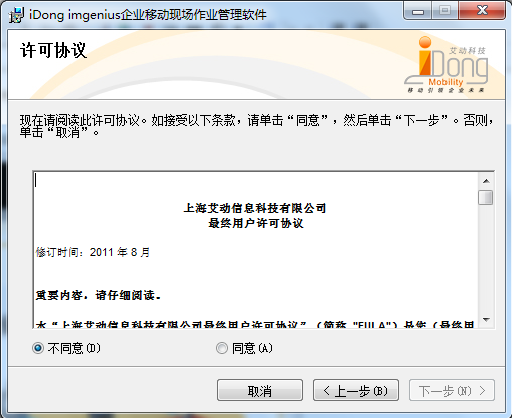
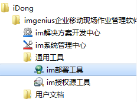
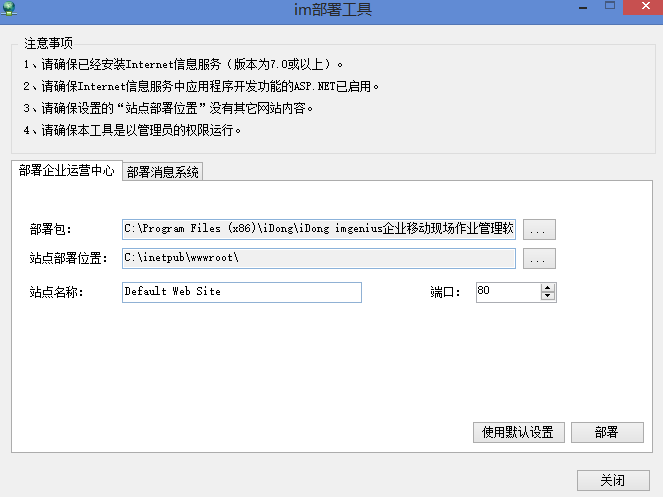
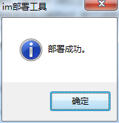
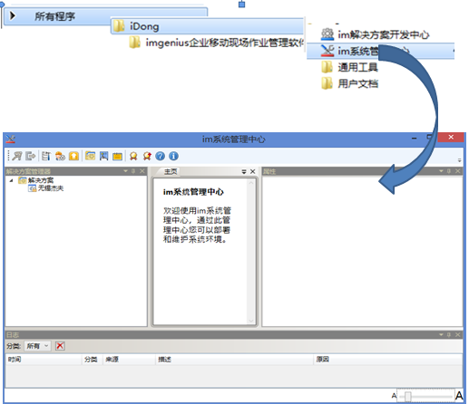
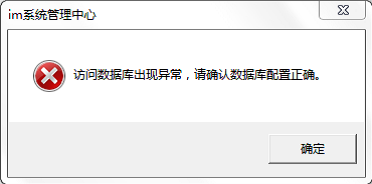
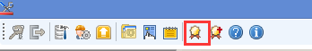
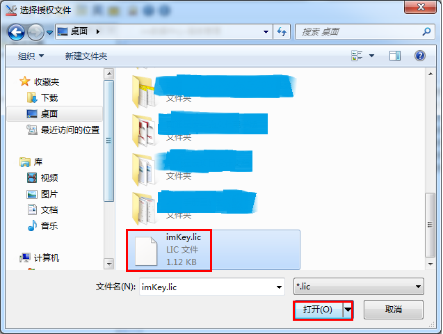
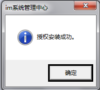

# 步骤
## 安装SQL Server 2008 R2 企业版（略）
## 安装. Net Framework 4.6.1（略）
## 安装和配置Internet信息服务（IIS）（略）
## 安装MongoDB

  * 拷贝安装光盘:\Redist\ MongoDB x64至计算机的C：\ MongoDB x64
  * 双击运行C：\ MongoDB x64\ServerInstall.bat 
  * 确认MongoDB服务已运行

    

## 安装RabbitMQ

  * 运行“otp_win64_20.0.exe”安装Erlang环境。（注：如果自行选择了安装路径，请确保安装路径无中文字符，如果已经安装忽略此步）
 

  * 运行“rabbitmq-server-3.6.10.exe”安装RabbitMQ。（注：如果自行选择了安装路径，请确保安装路径无中文字符，如果已经安装忽略此步）
 
  * 设置RabbitMQ：（如果已经设置忽略此步）
    * 修改缺省用户guest的密码，在cmd中运行下面语句
    ````
    "C:\Program Files\RabbitMQ Server\rabbitmq_server-3.6.10\sbin\rabbitmqctl" change_password guest iDong@mq
    ````
    * 创建用户，在cmd中分别运行以下命令

	````
    "C:\Program Files\RabbitMQ Server\rabbitmq_server-3.6.10\sbin\rabbitmqctl" add_user admin iDong@mq
    ````
    ````
	"C:\Program Files\RabbitMQ Server\rabbitmq_server-3.6.10\sbin\rabbitmqctl" set_user_tags admin administrator
    ````
    ````
	"C:\Program Files\RabbitMQ Server\rabbitmq_server-3.6.10\sbin\rabbitmqctl" set_permissions -p / admin ".*" ".*" ".*"
    ````
    * 启用Web管理插件，在cmd中运行下面语句：
    ````
		"C:\Program Files\RabbitMQ Server\rabbitmq_server-3.6.10\sbin\rabbitmq-plugins" enable rabbitmq_management
    ````

    > [!warning] 
    > 其中“C:\Program Files\RabbitMQ Server”为RabbitMQ安装路径，如果安装时已修改，请改成修改后的；“iDong@mq”为密码，用户可以设置成自己的密码。


  * 验证RabbitMQ，在IE中输入网址“http://localhost:15672”，在UserName和Password分别输入admin和iDong@mq，如果登录成功，表示安装成功。（如果已经验证忽略此步）

  * 把访问RabbitMQ的信息写入到imgenius配置文件中，在“C:\ProgramData\iDong\imParameters.xml”的“<Service>”节点内增加以下儿子节点：（如果已经添加，请确认信息是否完整和正确）
  ````
	<InternalMsg>
      	<Enable>True</Enable>
      	<HostName>192.168.1.101</HostName>
      	<UserName>admin</UserName>
      	<Password>iDong@mq</Password>
      	<WSHost>192.168.1.101</WSHost>
      	<WSHostPort></WSHostPort>
	</InternalMsg>
  ````
  > [!warning] 
  > 注：其中“HostName”为RabbitMQServer所在机器的IP地址；“UserName”和“Password”为第3步创建的用户和密码；“WSHost”为同步服务器所在机器的外网IP地址。

## 安装imgenius

  * 将imgenius光盘插入到计算机的DVD驱动器，安装程序将自动启动，或者打开光盘驱动器，双击运行setup.exe。
  * 在欢迎使用安装向导对话框中，单击下一步。
  * 在许可协议对话框中选择同意，单击下一步。
    
  * 在选择安装文件夹对话框中，单击下一步。
  * imgenius企业移动现场作业管理软件开始安装。安装大约需要几分钟的时间。
  * 安装完成对话框出现后，imgenius企业移动现场作业管理软件成功安装。单击关闭。
  * 安装完毕后，在开始菜单->程序，可以看到iDong->imgenius企业移动现场作业管理软件以及相应的组件。

    

## 部署im企业运营中心
  * 安装好imgenius以后，打开开始菜单→程序→iDong→imgenius企业移动现场作业管理软件→通用工具→im部署工具。

    

  * im部署工具将部署im企业运营中心站点。

    

  * 点击部署。部署工具将检查你是否安装了ASP.Net MVC。如果没有安装，将直接安装。
如果部署工具检测到你已经安装，会弹出对话框提示是否重新安装。
点击否，跳过ASP.Net MVC的安装步骤。开始部署，部署完成以后系统弹出完成提示框。

    

点击确定，回到部署工具窗口，点击关闭，退出应用。

## 安装授权

* 首次启动SMC
   

* 在没有正确配置数据库之前，启动im系统管理中心将会弹出以下对话框，请点击确定忽略。

  

* 在im系统管理中心单击工具栏 图标，加载imKey.lic文件（授权文件）。
  
   
   
* 确定，安装授权成功。
 
   

