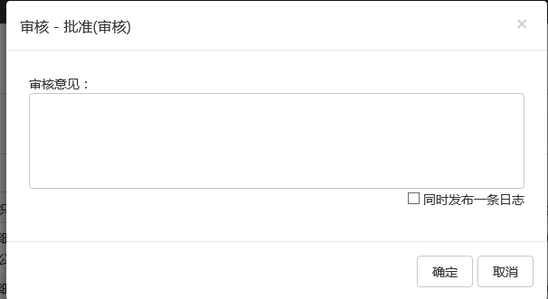
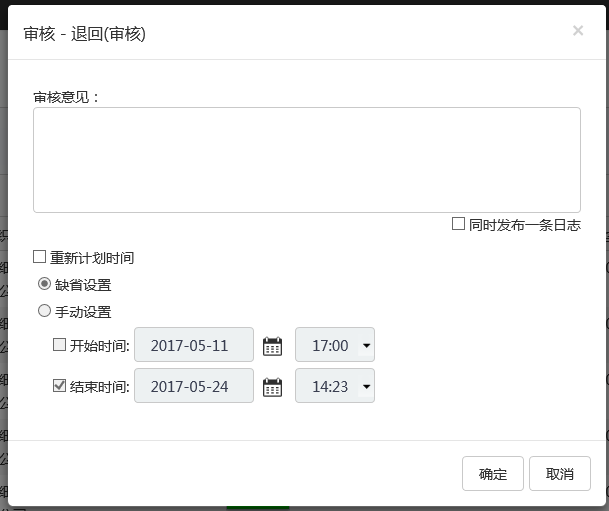

# 审核

## 审核操作
审核操作界面有以下六个操作：

批准：批准选中的作业组 

退回：退回选中的作业。

后退：后退到上一个业务活动。

终止：终止选中的作业组并将选中的作业组删除。

* 批准和终止界面

确定：确定批准选中的作业组

取消：取消本次操作

同时发布一条日志：当用户在审核意见栏输入文字时默认自动勾选，用户可以手动取消，若勾选那么本条审核意见将作为一条日志在日志界面出现。

* 退回和后退界面

重新计划时间：用户可以对退回（后退）的作业组进行计划时间的重新设定。选中重新计划时间选项后，缺省设置：当前时间加上开始时间与结束时间的间隔时间为新的计划开始时间。或者可以手动设置，手动定义重新计划时间。