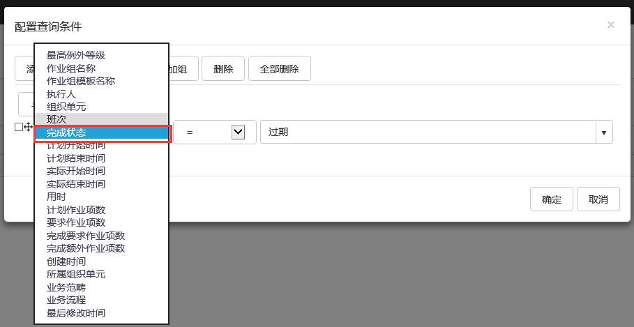

## 其他查询条件
针对查询条件，允许用户对一些特定字段作为条件进行查询。这些字段和条件包括：

* **作业组名称**：允许使用**作业组**名称进行筛选，条件可选择‘=’或者‘<>’。

* **执行人**：允许用户选择解决方案中配置的用户，条件可选择‘=’，‘<>’。

* **组织单元**：允许用户选择解决方案中配置的**组织单元**，条件可选择‘=’，‘<>’，‘包含’（所选**组织单元**以及其上级**组织单元**），‘属于’（所选**组织单元**以及其下级**组织单元**）。 

* **班次**:允许用户按照班次查询，条件可选择‘=’，‘<>’。

* **完成状态**:允许用户按照完成状态查询，条件可选择‘=’，‘<>’，‘>’，‘>=’，‘<’，‘<= ’。

* **计划开始时间**:允许用户按照**作业组**的计划开始时间查询，条件可选择‘=’，‘<>’，‘>’，‘>=’，‘<’，‘<=’。 

* **计划结束时间**:允许用户按照**作业组**的计划结束时间查询，条件可选择‘=’，‘<>’，‘>’，‘>=’，‘<’，‘<=’。

* **实际开始时间**:允许用户按照**作业组**的实际开始时间查询，条件可选择‘=’，‘<>’，‘>’，‘>=’，‘<’，‘<=’。

* **实际结束时间**:允许用户按照**作业组**的实际结束时间查询，条件可选择‘=’，‘<>’，‘>’，‘>=’，‘<’，‘<=’。

* **用时**:允许用户按照用时查询，条件可选择‘=’，‘<>’，‘>’，‘>=’，‘<’，‘<=’。

* **计划作业项数**:允许用户按照**作业组**计划作业项数查询，条件可选择‘=’，‘<>’，‘>’，‘>=’，‘<’，‘<=’。

* **要求作业项数**:允许用户按照**作业组**要求作业项数查询，条件可选择‘=’，‘<>’，‘>’，‘>=’，‘<’，‘<=’。

* **完成要求作业项数**:允许用户按照**作业组**完成的要求**作业项**数查询，条件可选择‘=’，‘<>’，‘>’，‘>=’，‘<’，‘<=’ 。

* **完成额外作业项数**:允许用户按照**作业组**完成的额外**作业项**数查询，条件可选择‘=’，‘<>’，‘>’，‘>=’，‘<’，‘<= ’。 

* **创建时间**:按照**作业组**的创建时间查询，条件可选择‘=’，‘<>’，‘>’，‘>=’，‘<’，‘<=’。

* **业务范畴**:按照**作业组**的**业务范畴**查询，条件可选择‘=’，‘<>’，‘包含’（管辖所选择**业务范畴**），‘属于’（被所选择**业务范畴**所管辖）。

* **最高例外等级**:按照作业组的最高**例外等级**查询，条件可选择‘=’，‘<>’，‘>’，‘>=’，‘<’，‘<=’。