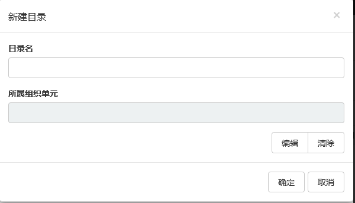
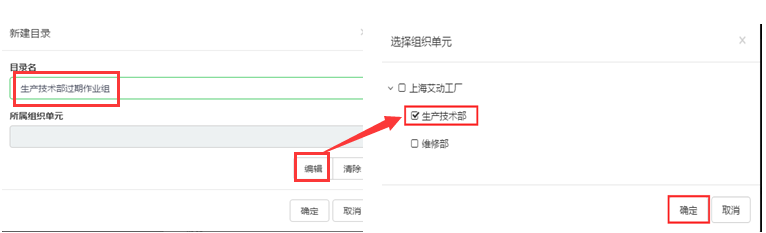

### 导航栏中编辑文件夹
选中“团队”或“个人”其下已经建立的查询文件夹，右键，在快捷菜单栏中可以选择新建文件夹、新建查询、编辑、复制、粘贴、删除和导出操作，如图：

* 新建目录：即创建一个自定义查询文件夹
* 新建查询：即在自定义查询文件夹根目录下创建一个查询。
* 编辑：编辑选中文件夹的属性。
* 删除：删除选中的文件夹。

编辑文件夹属性

选中需要编辑的文件夹，右击，在快捷菜单栏中选择编辑进入到编辑文件夹界面，如图：

示例：修改文件夹名为：生产技术部过期**作业组**，所属**组织单元**为：生产技术部，如图：

修改文件夹名为：生产技术部过期**作业组**，点击编辑，进入到设置**组织单元**界面，勾选生产技术部后单击确定，如图：配置完成后单击保存