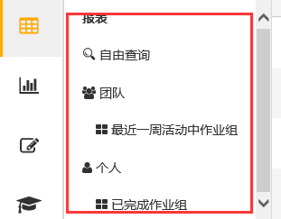

### 导航
存储活动中作业组个性查询的文件夹，方便团队和个人今后使用。

团队：可按**组织单元**定义文件夹，仅所属**组织单元**用户有权访问使用；不配置**组织单元**则所有人开放。

个人：仅登录用户个人使用。

自由查询：将查询条件重置回筛选器缺省设置。

右击快捷菜单栏：

* 新建文件夹：即创建一个自定义查询文件夹，内可以包含若干查询，也可嵌套子文件夹，用于对新建查询进行分类方便用户查询
* 新建查询：即在自定义查询文件夹根目录下创建一个查询，新建的查询右击可以实现编辑、删除。

