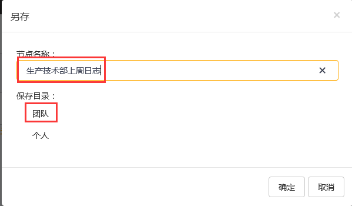

# 导航栏
在**筛选器**中选择相应的时间、**资产**和**组织单元**后，回到日志界面单击另存为，出现另存**查询条件**框，输入查询名以及选择保存目录。单击保存完成。

示例：另存为一个名为“生产技术部上周日志”的查询条件.

在右边筛选器中单击创建时间的展开 按钮，选择创建时间为：本周，如图：

在右边筛选器中单击**组织单元**的展开按钮，选择**组织单元**为：甲班，如图：

筛选条件选择完成后，单击另存为，系统弹出另存查询条件配置窗口，如图：

修改查询名为：甲班上周日志，保存目录为：团队，完成后单击保存，如图：

在导航栏查看保存的**另存查询条件**。

