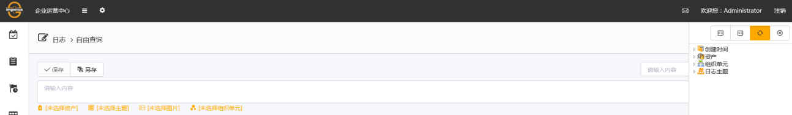
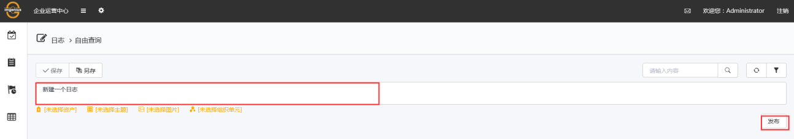
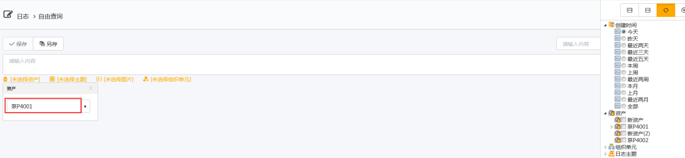
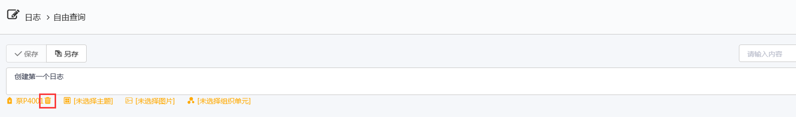

## 新建日志
进入imgenius企业移动现场**作业**管理系统，用户登录im企业运营中心后，选择**日志**页面，如图：

## 创建一个新日志
用户只需要在日志栏输入日志内容，完成后单击**发布**即可，如图：

用户还可以为日志选择一个**资产**，便于用户查询日志时进行筛选，选择**资产**时，在右边筛选器栏—**资产**中，双击需要选择的**资产**（鼠标移动至**资产**时底色会变色，在变色条上任意位置双击即可），如图：

若需要取消选择的**资产**，删除**资产**按钮，如图：

