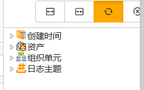

# 日志筛选器
日志筛选器中提供两类筛选条件：创建时间、**资产**和**组织单元**。筛选器为即选即显，只要勾选筛选条件，在内容栏就会显示相应的筛选结果。

* **创建时间**
以**作业组**创建到手持终端的时间为创建时间，提供一下时间筛选条件。创建时间只能为单选。
* **资产**
以SDC创建的**资产**为筛选条件，**资产**可以为多选。
* **组织单元**
以SDC中配置的**组织单元**为筛选条件，**组织单元**可以为多选。

