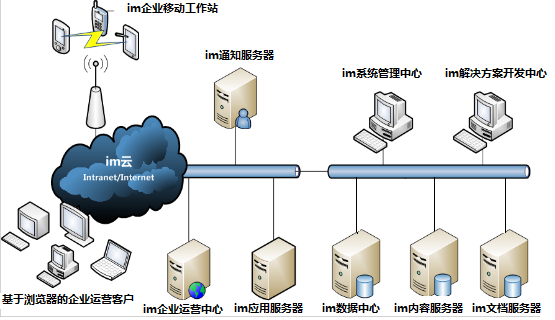
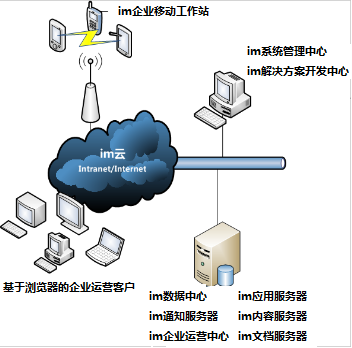
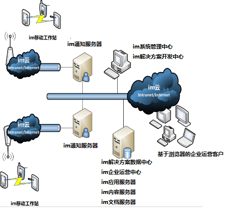

# 系统构成及部署模型
* imgenius企业移动现场作业管理软件由以下几个组件构成：
  * im解决方案数据中心— 整个系统的核心数据库，支持配置和运行的数据。采用Microsoft SQL Server。

  * im解决方案开发中心— 用于配置和部署解决方案的开发工作。

  * im系统管理中心— 用于对整个运行的系统进行管理，包括数据中心、服务、部署等组件和运行管理。

  * im应用服务器— 用于实现imgenius企业移动现场作业管理软件的核心运营服务，包括作业管理、业务流程引擎，数据管理等。

  * im通知服务器— 用于管理和实现整个解决方案的通讯服务，包括与im移动工作站的同步服务等。

  * im企业运营中心— 解决方案的日常运营Web站点，它实现了与企业用户的交互。

  * im内容服务器 —  用于系统中知识库以及运营日志的数据存储。

  * im文档服务器— 用于附件和知识库内嵌入图片以及日志中附带图片的存储。
  
  * im移动工作站— 支持手持终端上作业执行的应用。

* imgenius的构成组件均支持分布式通讯方式，可以实现灵活的分布式部署或者集中部署。

  * 分布式部署方案如下：
  
    

  * 这些组件也可以在系统管理中心（SMC）的集中管理下实现不同的部署方式，如下图：单一服务器部署方案。
  
    

  * 为了提高移动工作的效率，针对不同的移动终端的数量，也可在一个系统中部署多台通知服务器，以满足移动终端管理的需求，如下图：多通知服务器部署方案。
  
    