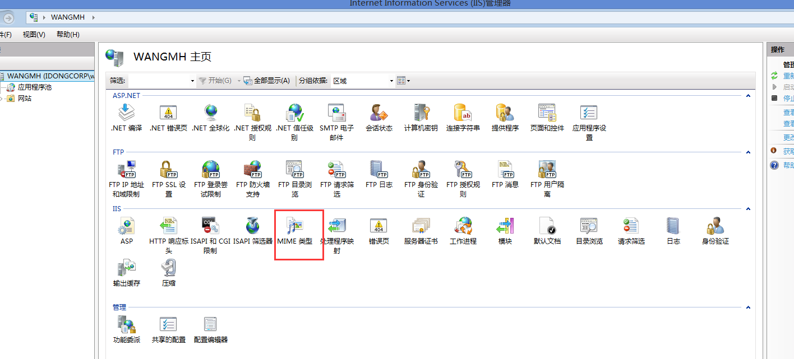
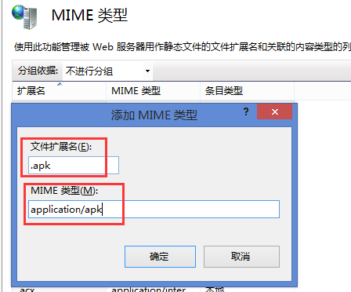
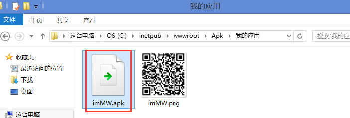
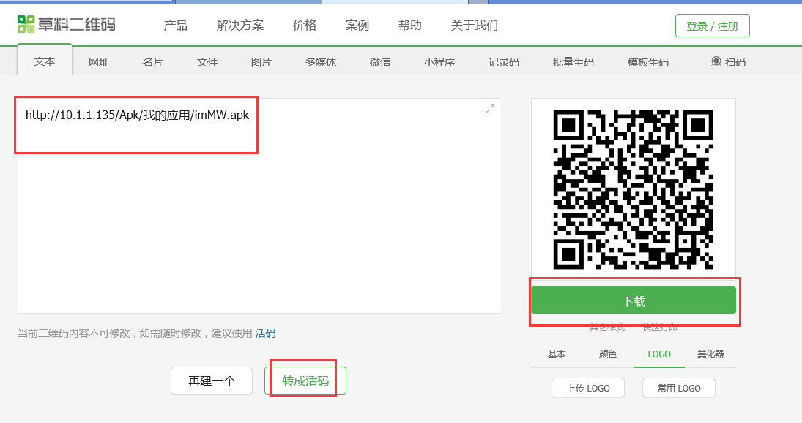
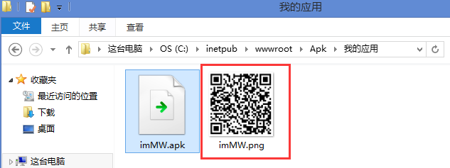

## 扫描二维码下载
imMW.apk”文件拷贝到“根路径\Apk\[工程名]\”下，比如：C:\inetpub\wwwroot\Apk\我的应用
在IIS配置一个

终端下载文件，把“imMW.apk”文件拷贝到“根路径\Apk\[工程名]\”下，
比如：C:\inetpub\wwwroot\Apk\我的应用

## 二维码下载
二维码下载：制作apk下载地址二维码图片“imMW.png”，拷贝到“根路径\Apk\[工程名]\”下，其中相关路径请自行创建。

在网上用二维码生成器生产一个二维码

图片名称改为“imMW.png”，拷贝到“根路径\Apk\[工程名]\”下

