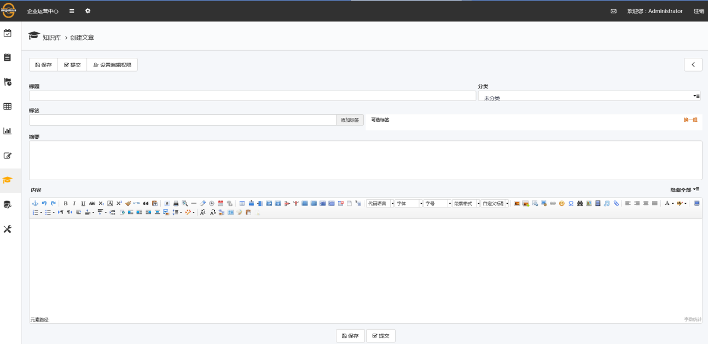

## 新建一片知识库文章
选择新建知识库文章后，系统进入创建文章界面，如图：

* **标题**：为本次建立的知识库文章起一个标题，可用于搜索。
* **分类**：可以将知识库文章分类，例如机械类，电气类。
* **标签**：为本次建立的知识库文章添加一个标签，可用于搜索。
* **摘要**：叙述本次建立的知识库文章的重点，概述等，可用于搜索。
* **正文**：录入本次知识库文章的主要内容，可用于搜索。