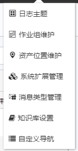
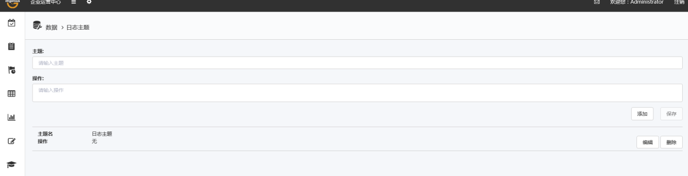

# 管理
管理页面是提供用户查看和管理自己的相关信息，具体分为：日志主题、作业组维护、资产位置维护、系统扩展管理、消息类型管理、知识库设置、自定义导航

* 日志主题：用户需要什么用户主题在此配置。

* **作业组维护**：页面提供用户**删除**错误或不需要的**作业组**，**导出作业组**信息。

* 资产位置维护：维护在地图在资产的位置。

* 系统扩展管理：在此配置客户个性化的报表。

* 消息类型管理：配置什么类型的消息。

* **知识库设置：配置知识库权限**。

* **自定义导航：导航可以在此自定义**。

## 日志主题

