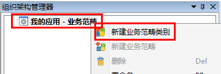
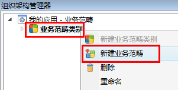

# 新建业务范畴

* 在导航栏→**组织架构管理器**→**业务范畴**内选择我的应用-**业务范畴**或点击空白处，右键快捷菜单选择**新建业务范畴类别**。
 
   

* 选中**新建业务范畴类别**，在右边属性栏中配置**业务范畴类别**的属性，如图：

   

  * **业务范畴类别名**：业务范畴类别的名称。
  * **业务范畴类别描述**：描述信息。

* 选中并右击**业务范畴类别**，新建业务范畴。

  

* 选中**新建业务范畴**，在右边属性栏中配置业务范畴的属性，如图：
   

  * **业务范畴名**：业务范畴的名称
  * **业务范畴描述**：描述信息
 
 示例：
   
   

> [!warning] 
> 业务范畴定义并不是必需的，如果按照组织单元、岗位和用户就能够描述企业的组织架构基础数据，那么可以不必定义业务范畴。
