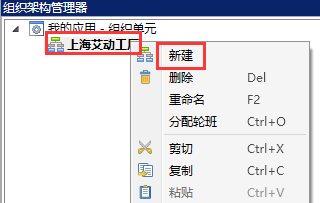
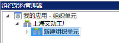
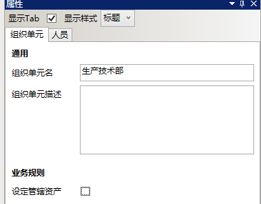

# 主要任务

按下表创建组织单元

  |上级组织单元名|组织单元名|组织单元描述|管辖资产|
  |:-:|:-:|:-:|:-:|
  |/|上海艾动工厂|/|不勾选|
  |上海艾动工厂|生产技术部|/|不勾选|
  |上海艾动工厂|维修部|/|不勾选|

* 创建组织单元：上海艾动工厂（略）

* 在组织单元：上海艾动工厂选中上海艾动工厂，右击，在快捷菜单栏选择新建，如图：

  
 
* 将新建组织单元改名为：甲班，如图：

     
      

* 右边属性框配置（本处无需任何配置），如图：

     
