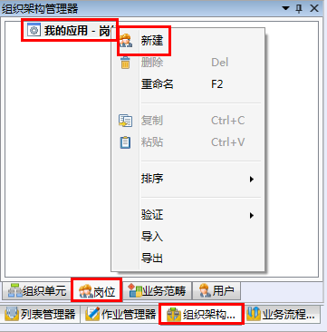
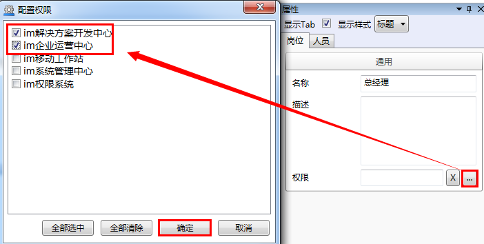

# 新建岗位

* 在导航栏→**组织架构管理器**→**岗位**内选择我的应用-**岗位**，右击，在快捷菜单栏中选择**新建**。

  

* 选择新建的岗位，在右侧属性栏岗位配置窗口内配置（例如）：
  * 名称：岗位名

  * 描述：岗位描述

  * 权限：单击  进入配置权限，选择和此岗位对应的软件使用权限。
 
  示例：

  

  > [!warning] 
  > **权限**配置仅在解决方案启用了安全以后有效。对解决方案启用安全去解决方案节点，在属性栏勾选**启用安全**。启用了安全的解决方案在启动解决方案开发中心时，将弹出登录验证对话框。
