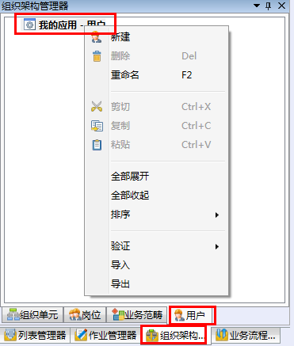

# 配置用户

在导航栏→**组织架构管理器**→**用户**内右键当前应用-**用户**，在快捷菜单中即可完成用户的**新建**、**删除**、**重命名**、**剪切**、**复制**、**粘贴**、**全部展开**、**全部收起**、**排序**、**验证**、**导入**和**导出**操作

  

# LAB 7新建用户

* 在导航栏→**组织架构管理器**→用户内选择我的应用-用户，右键快捷菜单选择**新建**。

   

* 选择新建用户，在右侧属性栏，用户配置窗口内，如下配置：

   