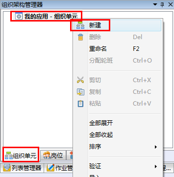
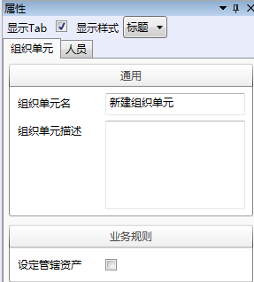
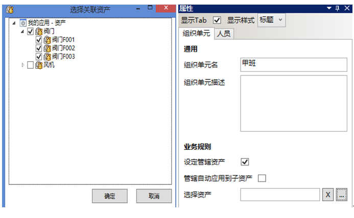

# 新建组织单元
* 在导航栏→**组织架构管理器**→**组织单元**内，选择我的应用-**组织单元**，右击，在快捷菜单中选择**新建**。

  

* 选中新建的组织单元，在右边属性栏中配置组织单元属性，如图：

  

  * **组织单元名**：组织单元的名称。

  * **组织单元描述**：描述信息。

  * **设定管辖资产**：若不勾选此选项，则表示此组织单元管辖所有资产。勾选此选项后可在资产选择对话框中选择管辖的资产。不选择任何资产，则表示此组织单元不管辖任何资产。一个组织单元只能够查看和执行管辖资产的作业组。
 
   示例：
   