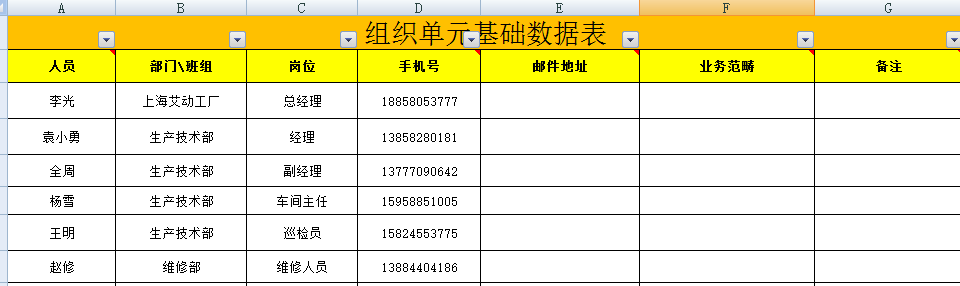
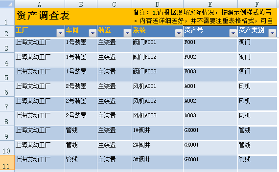
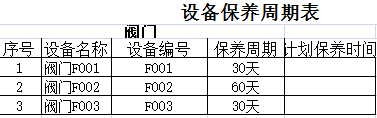
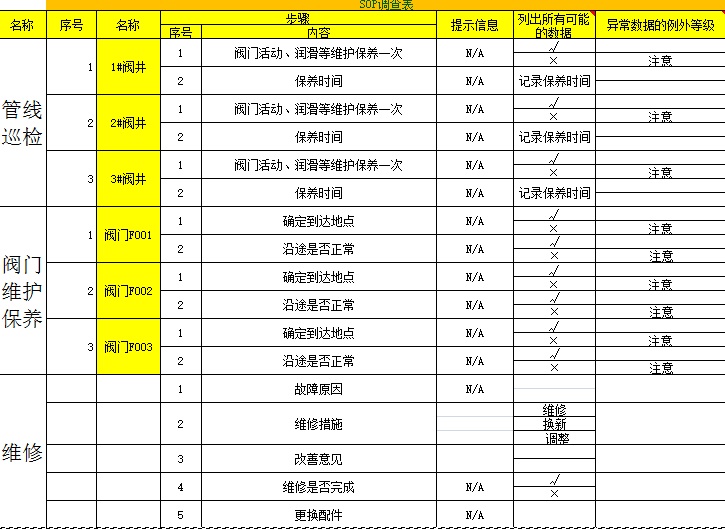

# 作业管理器介绍

* 在imgenius企业移动现场作业管理软件中，使用im解决方案开发中心→作业管理器来配置和管理代表企业实际现场作业的作业组和作业规范。 
作业规范是imgenius企业移动现场作业管理系统提供的作业模版，一个作业规范允许在一个或多个作业组内引用。
作业项对应现场工作中的一项工作，可指定一种数据变量类型。
作业是作业项和作业的集合，即作业下可嵌套作业，作业可以来自作业规范的引用，作业通常包含一个资产的所有作业项。
作业组是用户一次现场作业活动的集合。作业组下包含作业、作业项，是一个树状视图。 
  * 作业组
  * 作业
  * 作业项

* 案例：
  按照以下SOP表配置一个简单的上海艾动工厂案例

   

   

   

   

**主要实现**

* 管线巡检，巡检过程中，如果发现问题可以随时上报生成一个维修作业组

* 车间巡检

* 定期阀门校验（作业后自动创建设备规定周期后的保养作业）

* 随时上报维修，巡检问题自动上报维修

* 报表分析：巡检到底做的怎么样？保养是否准时及时？哪些设备维修的多？维修的工时到底是多少？谁维修的最快最好？

  首先按照组织单元基础数据表，配置好上海艾动工厂的组织架构，再按照资产调查表配置资产，根据SOP调查表，设备维护保养周期表配置相关的作业规范，作业组
