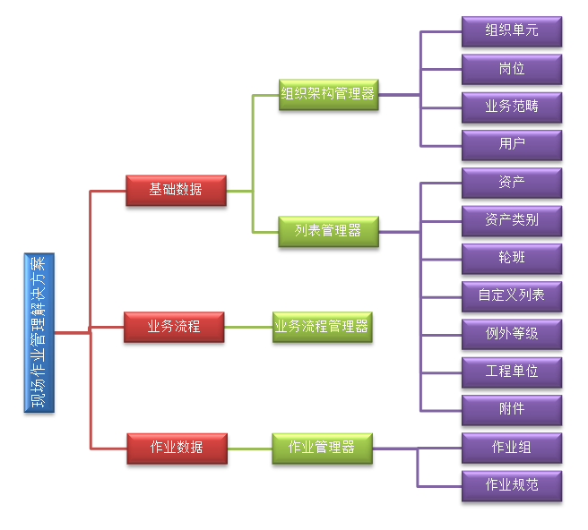
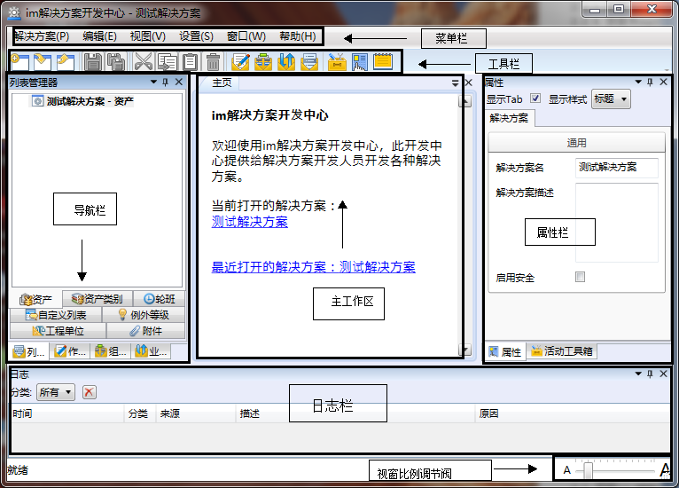

# 解决方案开发中心(SDC)介绍

本章讲述im解决方案开发中心中各个单元部分的功能。

imgenius系统解决方案构成：

  

**im解决方案开发中心**（Solution Development Center, 简称**SDC**）是imgenius企业移动现场作业管理软件创建、配置现场作业管理解决方案的组件。使用SDC通常是建立基于imgenius的现场作业管理解决方案的第一步。
im解决方案开发中心的完全界面主要由菜单栏、工具栏、导航栏、主工作区、属性栏以及日志栏构成。

  