### 详细步骤
1. 使用“杨雪”登录im企业运营中心

打开IE8，输入**http://localhost**

在im企业运营中心界面使用“杨雪”登录，密码为缺省的：1234，如图：

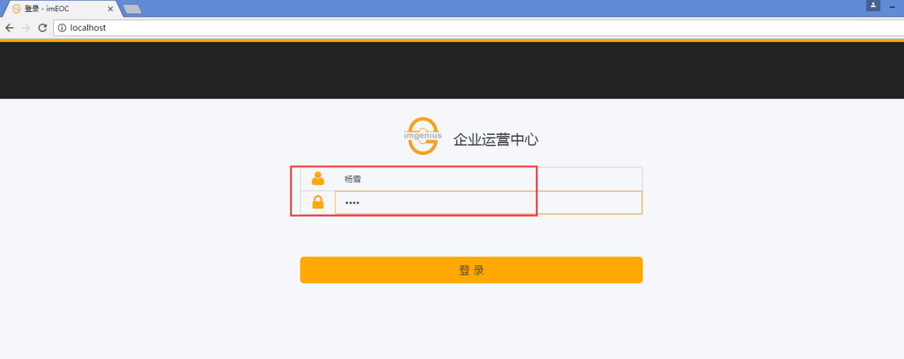

2. 进入计划页面，选择新建，如图：

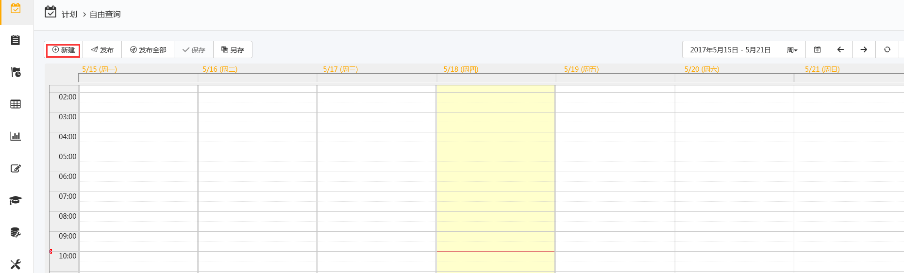

单击新建后，系统弹出新建计划的配置界面，如图：

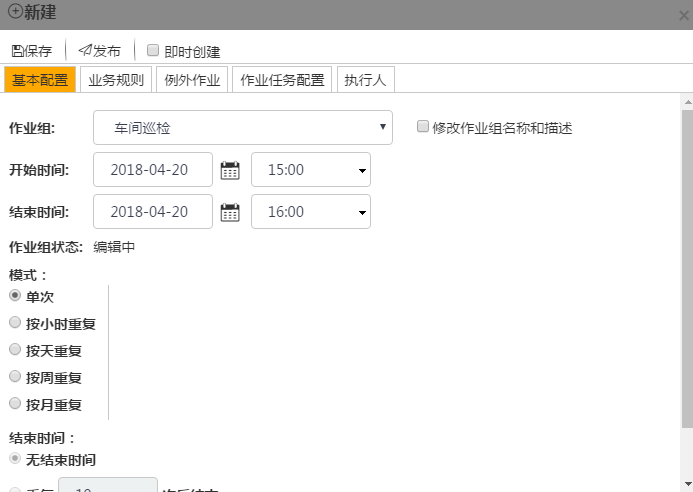

3. “车间巡检”为一个当前时间开始的单次任务

在计划页面的模式中选择单次（本处为缺省），开始时间为缺省（但必须大于当年时间）如图：

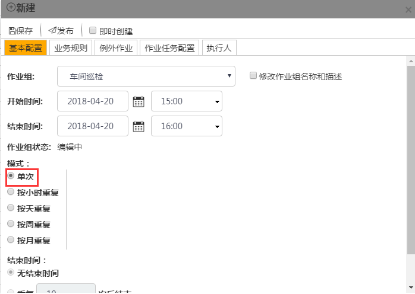

注意：开始时间和结束时间的修改，可以直接选中需要修改的时间直接修改，如图：

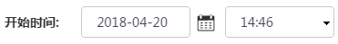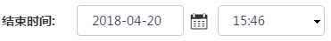

4. “日常巡检”的业务规则为：不允许作业组提前1小时开始，不允许作业组延迟1小时结束。

在计划配置界面选择“业务规则”，如图：

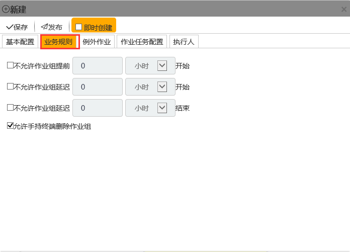

在勾选框勾选：不允许**作业组**提前，不允许**作业组**延迟，如图：

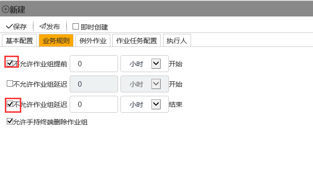

勾选完毕后，在文本框中输入数值：1，表示不允许**作业组**提前1小时开始（不允许**作业组**延迟同上），如图：

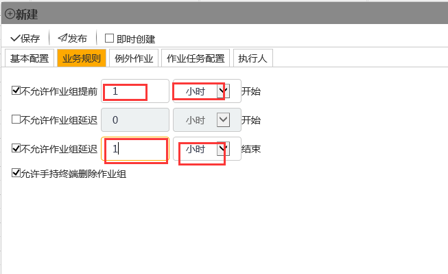

5. “日常巡检”的执行人为按照流程

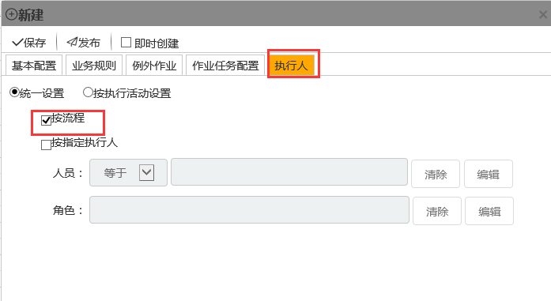

6. 计划一个“管线巡检”下周一8:00开始9:00结束重复180次，每4小时一次的重复计划，业务规则为：不允许作业组提前1小时开始，不允许**作业组**延迟1小时结束，下下周为例外时段，例外**作业**：无，执行人：按照流程的“日常巡检”**作业组**。
在计划页面选择新建，在开始时间的日期选择框中选择下星期一，如图：

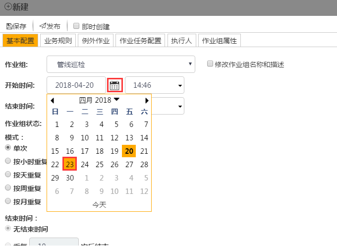

在时间选择框中选择8:00，如图：

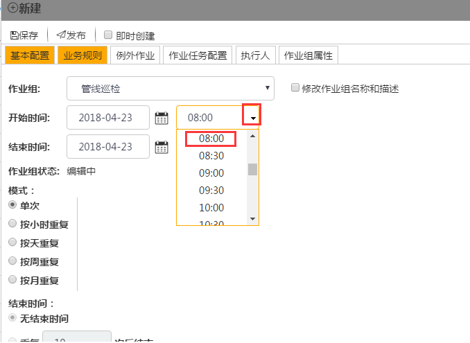

同理，结束时间为：下周一（4月23日）的9:00，如图：

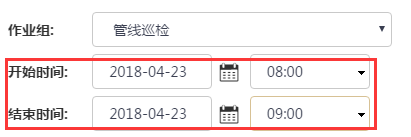

在模式中选择按小时重复，修改为：每4小时一次，修改结束时间为：重复180次后结束，如图：

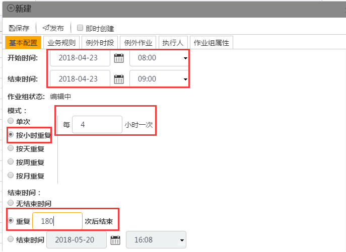

在计划配置界面选择“业务规则”，将业务规则修改为：不允许**作业组**提前1小时开始，不允许**作业组**延迟1小时结束，如图：

将下下周配置为例外时段，点击例外时段选择新建，如图：

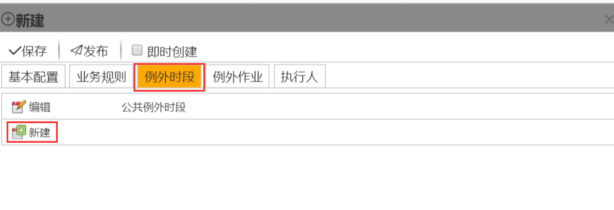

进入到新建例外时段界面，修改例外时段名为：下周为例外时段，修改开始时间为：开始时间的下周（本处为4月23日），修改结束时间为：（本处为5月20日），勾选全天勾选框，如图：

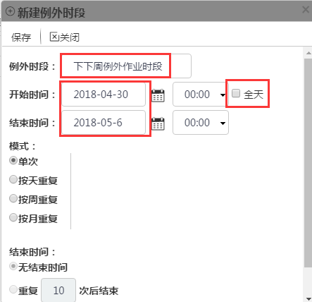

单击保存，完成例外时段配置。
例外**作业**和执行人缺省（本处无需配置）。

单击，完成本次计划任务。

注意：请根据当前实际时间定义下周与下下周。

7. 即时创建一个4小时后开始，需时1小时的“管线巡检”计划，将**作业**对象由1#阀井改为4#阀井，业务规则为：不允许**作业组**提前1小时开始，不允许**作业组**延迟1小时结束，执行人：张一旭。

在计划页面单击新建，开始时间为当前时间的4小时之后，结束时间为当前时间的5小时之后并且勾选即时创建，如图：

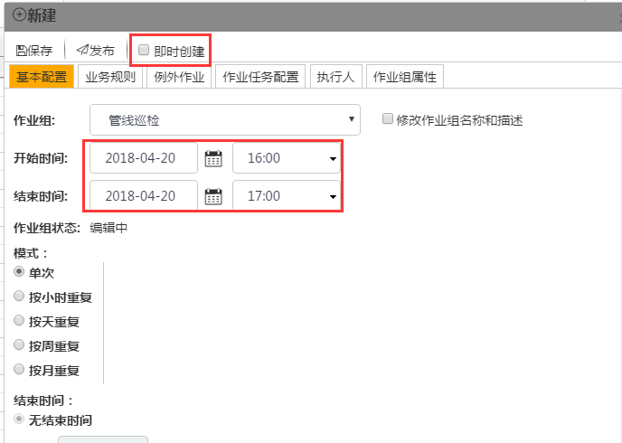

业务规则为：不允许**作业组**提前1小时开始，不允许**作业组**延迟1小时结束，如图：

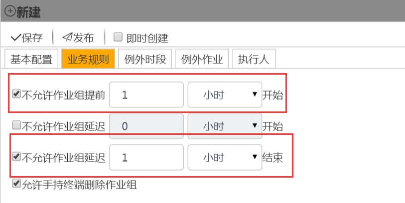

将**作业**对象由泵P4001改为泵P4002，点击**作业**配置，选中**资产**（属性）为泵P4001的**作业**，在右边操作栏选择编辑节点，如图：

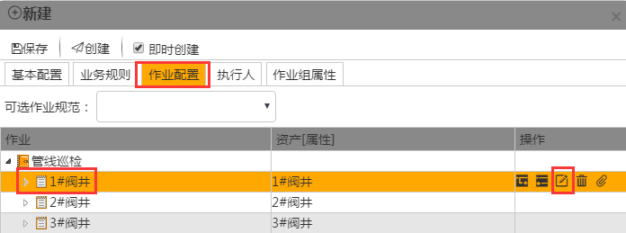

进入到编辑作业界面，将可选资产修改为：泵P4002，修改完成后保存，如图：

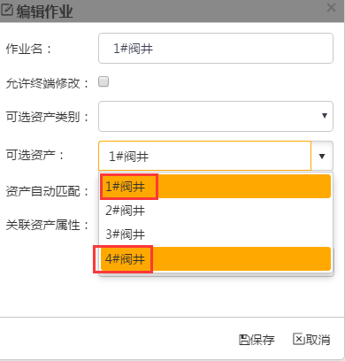

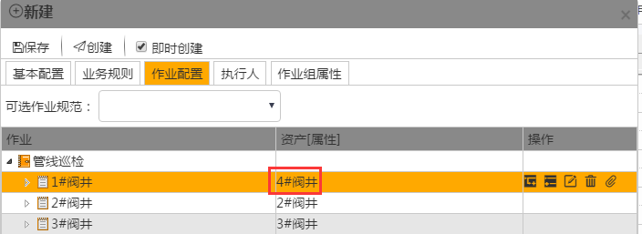

修改执行人为：张一旭，单击执行人，在勾选按指定执行人并且取消勾选按流程，如图：

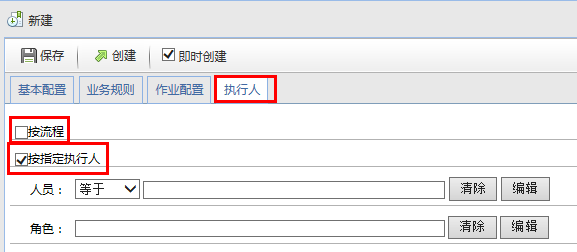

在**人员**选择框选择编辑，在用户界面选择张一旭，保存后完成，如图：

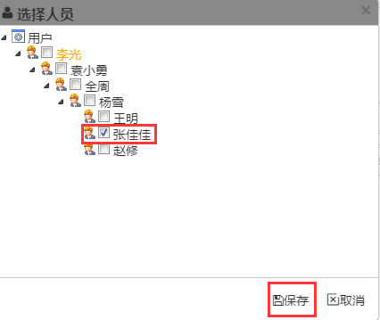

配置完成后单击，完成计划的即时创建。