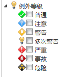

# 导航栏
审核的导航栏提供两类筛选条件供用户对待审核列表进行筛选。一是按照完成时间，二是按照例外等级。

在整个im企业运营中心的所有以时间为筛选条件的导航栏，均提供解决方案内建的以下12个时间项，方便用户进行选择。基于时间的筛选条件为单选。
* 今天  
* 昨天  
* 最近两天  
* 最近三天  
* 最近五天  
* 本周  
* 上周  
* 最近两周  
* 本月  
* 上月  
* 最近两月  
* 全部  

例外等级导航栏根据用户配置的所有例外等级提供用户筛选，用户可以选择一个或者多个例外等级，只有最高例外等级与选择的例外等级相同的作业组才能列出。每个等级前面的图标为用户自己在im解决方案中心中配置的图标。

这两个类别的筛选条件可以同时生效，比如最近两天的警告例外等级的作业组。只有满足所有条件的作业组才列出。