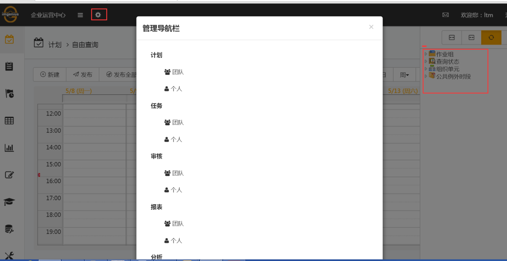
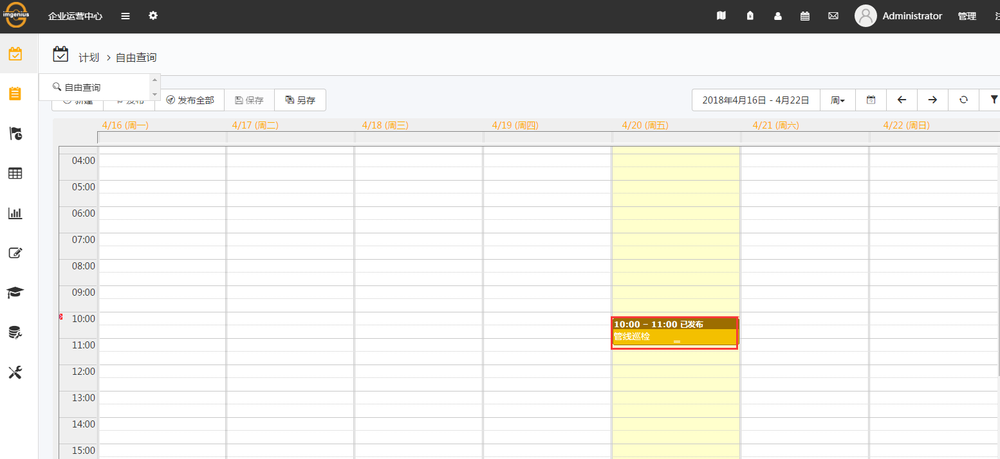

# 计划
用户登录im企业运营中心后，在计划页面可以对**作业组**进行计划排程，即执行**业务流程**中的计划活动。

在im企业运营中心主页标题栏单击计划标签，进入计划页面。计划页面左侧为导航栏，中间为计划视图，右侧为筛选器。

## 新建一个单次计划
在计划页面选择新建或者在日期段内单击。

在新建页面配置如图：

修改**作业组**名称和描述：在修改**作业组**名称和描述框中勾选，则可修改**作业组**的名称，并且可以添加**作业组**描述，如图：

注意：开始时间必须大于当前时间。

单击发布后，计划的显示界面，如图：

