# 计划的业务规则
计划的业务规则是对该计划产生的**作业组**实例执行的一个业务约束，由计划的时候配置产生。该业务规则将对由本计划产生的所有**作业组**实例有效。

* 不允许**作业组**提前开始 

**作业组**不可以在计划开始时间前提前开始执行。可以设定一个时间段，早于计划开始时间 - 这个时间段，**作业组**在手持终端上是不可见的。

* 不允许**作业组**延迟开始 

**作业组**不可以在计划开始时间+预设时间段以后开始执行。

* 不允许**作业组**延迟结束

计划结束时间+设定的时间段以后结束的**作业组**将视为过期。过期数据将丢失。 

* 允许手持终端删除**作业组**

允许手持终端在终端上删除该**作业组**，但该**作业组**实例在解决方案中仍然存在。再次同步将会再次获得此**作业组**。
## 计划的例外作业
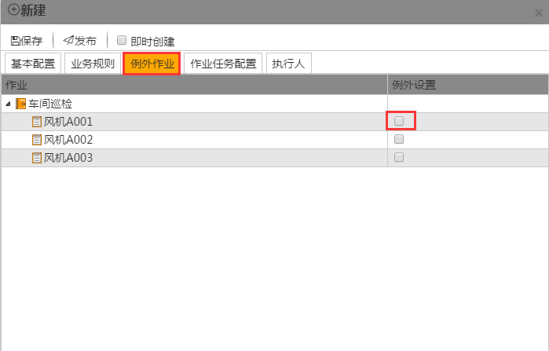

设置该**作业组**中的**作业**是否需要例外，即选定的**作业**不用执行。 如勾选父级作业则将包含其子项，如只勾选子项则只有该子项被例外。 用户可以通过例外**作业**灵活配置巡检内容，达到提高效率的目的。
## 计划的执行人
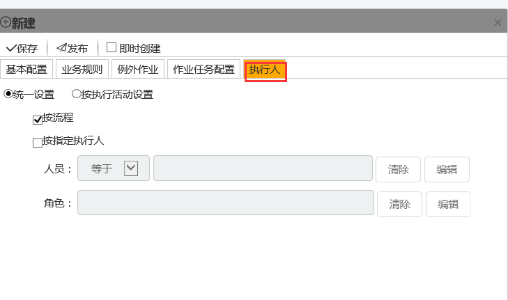
* 按流程

 勾选**按流程**后该作业组的执行人按照SDC**业务流程管理器**中配选的流程**作业**块中的执行人执行。

* 按指定执行人 

勾选**按指定执行人**后，可以选用两种配置方式，**人员**选择等于（不等于）某个指定的**人员**（不等于这个**人员**的所有其他人）。角色指定为某个**岗位**或者部门中的所有人。

注意：如果同时勾选**按流程**和**按指定执行人**，这两者的关系为并行，即两者都可执行。

## 计划的发布和保存
指定日期内按照配置的循环规则对**作业组**排程，计划**作业组**发布后，系统在其计划开始时间前2小时（系统缺省值，可变更）将**作业组**实例创建至数据中心，然后同步至手持终端，此时此计划变更为已创建，不允许再修改；不到创建时间的计划**作业组**维持发布状态，允许修改。计划作业组普遍应用于日常、既定生产作业的排程。

在计划**作业组**过程中也可使用保存功能，保存的计划状态为：编辑中，不会被系统创建，并且可以重新编辑，适用于当计划者需要核对计划信息时做暂缓处理。

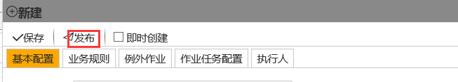

## 创建重复的计划
在计划页面选择新建或者在日期段内单击。

在时间安排选项卡中，你选择计划的**作业组**，以及要求它**作业**的时间段，也可以是重复模式，针对重复模式，你还可以指定其结束的时间或重复的次数。

重复模式包括以下几种：  
* 按小时重复：**作业组**应以设定的小时数重复执行 

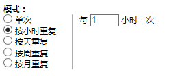

* 按天重复：**作业组**应以天为周期重复执行，可设定重复的天数间隔

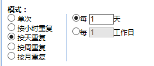

* 按周重复：**作业组**应以周为周期重复执行 

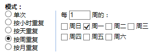

* 按月重复：作业组应以月为周期重复执行 

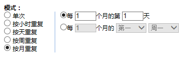

对于重复周期模式的计划，还应配置其结束时间。结束时间有三种配置可选：
* 无结束时间：不设定**作业组**计划停止创建的时间，**作业组**计划一直按选定模式创建 

* 重复数次后结束：**作业组**计划重复设定次数后停止创建 

* 结束时间：设定**作业组**计划停止创建的具体时间 

## 重复计划的例外时段
用户在进行计划时，允许其对该计划设置例外时段。在该例外时段内的计划将被屏蔽。 例外时段设置允许用户使用公共例外时段或者单独创建针对本计划的例外时段。

在新建界面，选择例外时段，在里面时段界面进行配置，如图：

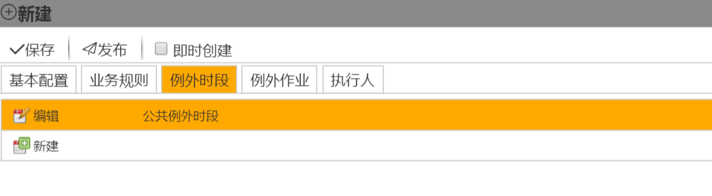

单击新建，新建一个例外时段，如图：

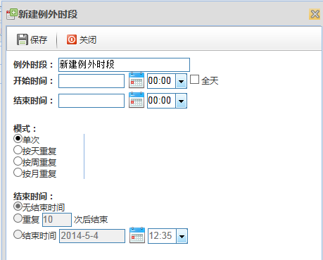

例外时段：修改例外时段名称。

开始时间：例外时段的开始时间。

结束时间：例外时段的结束时间。

模式：例外时段可以是单次，也可以是按天（按周、按月）重复。

结束时间：对于重复周期模式的计划，还应配置其结束时间。结束时间有三种配置可选：
* 无结束时间：不设定**作业组**计划停止创建的时间，**作业组**计划一直按选定模式创建 

* 重复数次后结束：**作业组**计划重复设定次数后停止创建 

* 结束时间：设定**作业组**计划停止创建的具体时间 

## 计划的修改
* 修改单次计划

发布后以及编辑中的**作业组**，如果没有被**作业**管理引擎创建进入**业务流程**（即黄色或灰色状态下），是可以进行编辑和修改的。点击希望编辑的**作业组**计划实例，将弹出**作业组**计划操作标签。
选中需要修改的计划，在图标上单击，系统弹出查看、编辑、删除对话框，单击编辑就可以对计划进行修改，如图：

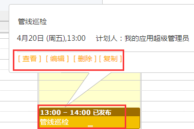 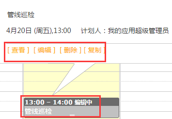

单击编辑后，进入到编辑界面并对计划进行修改，修改完成后单击发布。

* 修改重复计划

针对重复计划的序列，有两种修改模式，第一种是从点击的**作业**计划开始重新编辑该序列。如果你进行了保存或发布，将从该计划重新按照新的配置生成一个新的计划序列；第二种是点击转化为单次，你可以将该计划从序列中提出来，转换为一个单次的计划，然后进行修改，修改只针对这一个计划。

选中需要修改的计划，单击该计划，系统弹出查看、编辑、删除、转化为单次对话框，如图：

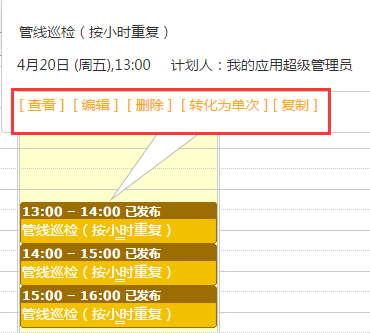

转化为单次：选择转化为单次后，计划的修改同单次计划修改，， “是否转化为单次进行编
不转换为单次：表示本次修改的对象是从选中的计划开始的整个计划序列。会按照新的配置生成一个新的计划序列。

## 作业组实体的创建
**作业**计划发布后，**作业组**的状态为已发布（即为黄色），当已创建计划的开始时间与当年时差在2小时之内，那么**作业组**实例被创建，状态自动变更为已创建（即为蓝色）。已创建的计划可以被手持设备下载执行。

注意：**作业组**自动创建提前时间可以在im解决方案开发中心→设置中修改。im解决方案开发中心→设置将在下文第13章详细介绍。

## 即时创建
即时创建：指定日期内按照配置的循环规则对**作业组**排程，系统即时将所有作业组实例创建至数据中心，已创建的**作业组**不允许修改，**作业组**在没有归档前，可以使用超级用户删除。

创建**作业组**允许对**作业组**内容进行增加、删减、修改**作业**名称、**关联资产**等配置操作，并可重新指定**作业组**执行人。创建**作业组**更适用于临时、偶发性的**作业**安排。

## 即时创建的作业配置
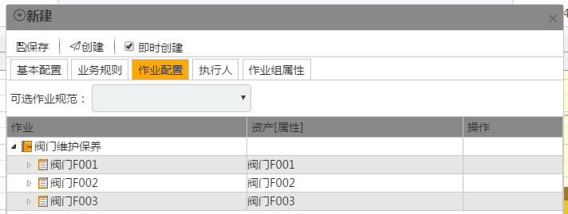

**作业**配置可以：
* 添加同层节点：在同层位置添加一个可用的作业规范的引用。
* 添加子节点：在子节点位置添加一个可用的作业规范的引用。
* 编辑节点：编辑选中的节点

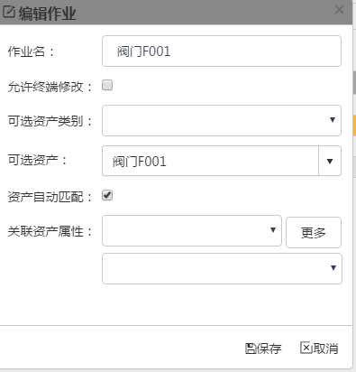

**作业名**：修改**作业名**。

允许终端修改：是否允许手持终端修改该**作业**。

可选**资产类别**：选择一个可用的**资产类别**。

**资产**自动匹配：自动匹配**资产**。

**关联资产属性**：关联一个**资产**属性。

* 删除节点：删除选中的节点。

* 添加**附件**：在选中的节点处添加一个**附件**。

通过这些操作来即时创建一个符合要求的**作业**。