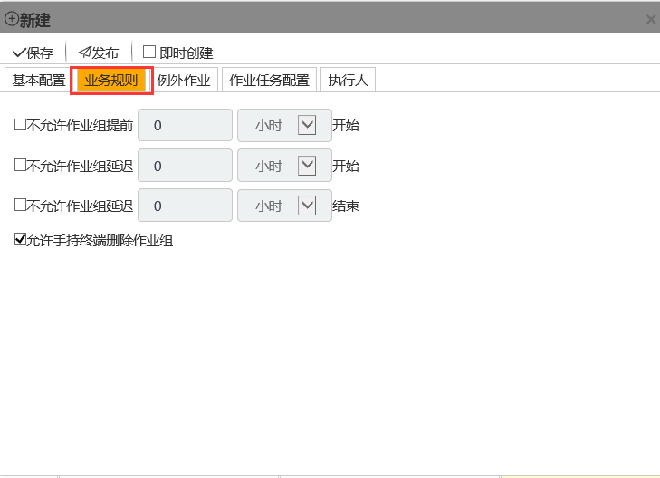

## 计划的业务规则
计划的业务规则是对该计划产生的**作业组**实例执行的一个业务约束，由计划的时候配置产生。该业务规则将对由本计划产生的所有**作业组**实例有效。

* 不允许**作业组**提前开始 

**作业组**不可以在计划开始时间前提前开始执行。可以设定一个时间段，早于计划开始时间 - 这个时间段，**作业组**在手持终端上是不可见的。

* 不允许**作业组**延迟开始 

**作业组**不可以在计划开始时间+预设时间段以后开始执行。

* 不允许**作业组**延迟结束

计划结束时间+设定的时间段以后结束的**作业组**将视为过期。过期数据将丢失。 

* 允许手持终端删除**作业组**

允许手持终端在终端上删除该**作业组**，但该**作业组**实例在解决方案中仍然存在。再次同步将会再次获得此**作业组**。