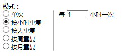
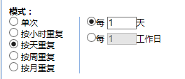
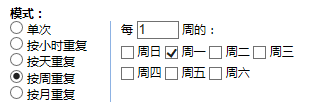
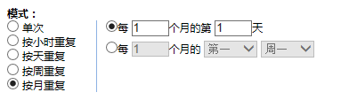

# 创建重复的计划
在计划页面选择新建或者在日期段内单击。

在时间安排选项卡中，你选择计划的**作业组**，以及要求它**作业**的时间段，也可以是重复模式，针对重复模式，你还可以指定其结束的时间或重复的次数。

重复模式包括以下几种：  
* 按小时重复：**作业组**应以设定的小时数重复执行 

* 按天重复：**作业组**应以天为周期重复执行，可设定重复的天数间隔

* 按周重复：**作业组**应以周为周期重复执行 

* 按月重复：作业组应以月为周期重复执行 

对于重复周期模式的计划，还应配置其结束时间。结束时间有三种配置可选：
* 无结束时间：不设定**作业组**计划停止创建的时间，**作业组**计划一直按选定模式创建 

* 重复数次后结束：**作业组**计划重复设定次数后停止创建 

* 结束时间：设定**作业组**计划停止创建的具体时间 