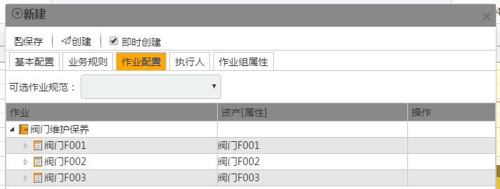
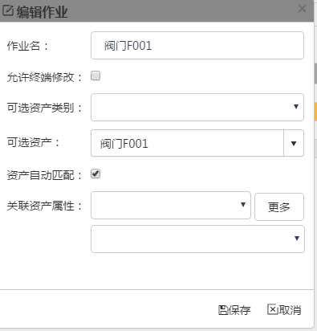

### 即时创建的作业配置

**作业**配置可以：
* 添加同层节点：在同层位置添加一个可用的作业规范的引用。
* 添加子节点：在子节点位置添加一个可用的作业规范的引用。
* 编辑节点：编辑选中的节点

**作业名**：修改**作业名**。

允许终端修改：是否允许手持终端修改该**作业**。

可选**资产类别**：选择一个可用的**资产类别**。

**资产**自动匹配：自动匹配**资产**。

**关联资产属性**：关联一个**资产**属性。

* 删除节点：删除选中的节点。

* 添加**附件**：在选中的节点处添加一个**附件**。

通过这些操作来即时创建一个符合要求的**作业**。