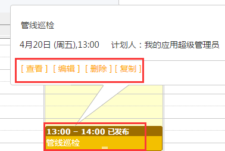
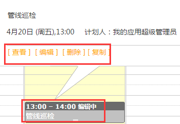
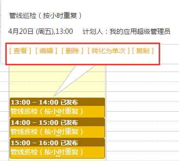

## 计划的修改
* 修改单次计划

发布后以及编辑中的**作业组**，如果没有被**作业**管理引擎创建进入**业务流程**（即黄色或灰色状态下），是可以进行编辑和修改的。点击希望编辑的**作业组**计划实例，将弹出**作业组**计划操作标签。
选中需要修改的计划，在图标上单击，系统弹出查看、编辑、删除对话框，单击编辑就可以对计划进行修改，如图：

 

单击编辑后，进入到编辑界面并对计划进行修改，修改完成后单击发布。

* 修改重复计划

针对重复计划的序列，有两种修改模式，第一种是从点击的**作业**计划开始重新编辑该序列。如果你进行了保存或发布，将从该计划重新按照新的配置生成一个新的计划序列；第二种是点击转化为单次，你可以将该计划从序列中提出来，转换为一个单次的计划，然后进行修改，修改只针对这一个计划。

选中需要修改的计划，单击该计划，系统弹出查看、编辑、删除、转化为单次对话框，如图：

转化为单次：选择转化为单次后，计划的修改同单次计划修改，， “是否转化为单次进行编
不转换为单次：表示本次修改的对象是从选中的计划开始的整个计划序列。会按照新的配置生成一个新的计划序列。