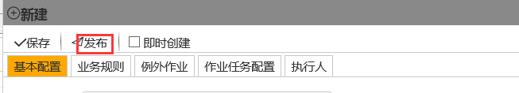

### 计划的发布和保存
指定日期内按照配置的循环规则对**作业组**排程，计划**作业组**发布后，系统在其计划开始时间前2小时（系统缺省值，可变更）将**作业组**实例创建至数据中心，然后同步至手持终端，此时此计划变更为已创建，不允许再修改；不到创建时间的计划**作业组**维持发布状态，允许修改。计划作业组普遍应用于日常、既定生产作业的排程。

在计划**作业组**过程中也可使用保存功能，保存的计划状态为：编辑中，不会被系统创建，并且可以重新编辑，适用于当计划者需要核对计划信息时做暂缓处理。

