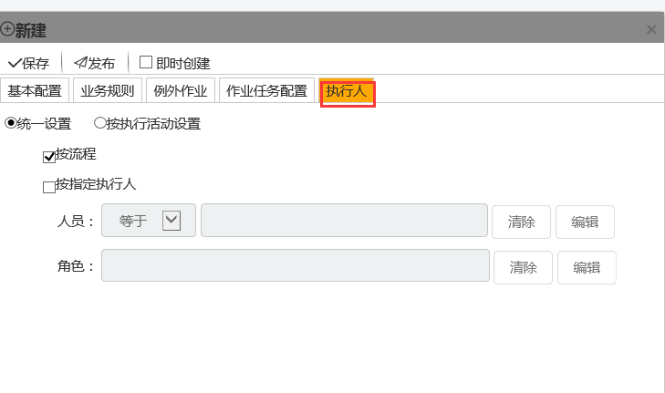

### 计划的执行人

* 按流程

 勾选**按流程**后该作业组的执行人按照SDC**业务流程管理器**中配选的流程**作业**块中的执行人执行。

* 按指定执行人 

勾选**按指定执行人**后，可以选用两种配置方式，**人员**选择等于（不等于）某个指定的**人员**（不等于这个**人员**的所有其他人）。角色指定为某个**岗位**或者部门中的所有人。

注意：如果同时勾选**按流程**和**按指定执行人**，这两者的关系为并行，即两者都可执行。