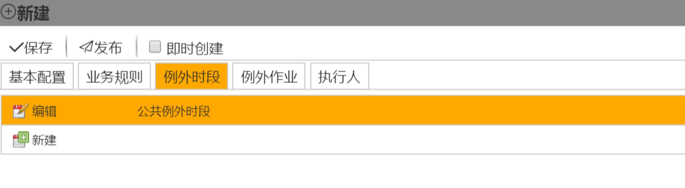
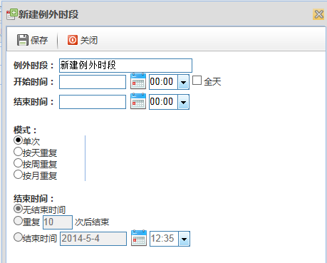

## 重复计划的例外时段
用户在进行计划时，允许其对该计划设置例外时段。在该例外时段内的计划将被屏蔽。 例外时段设置允许用户使用公共例外时段或者单独创建针对本计划的例外时段。

在新建界面，选择例外时段，在里面时段界面进行配置，如图：

单击新建，新建一个例外时段，如图：

例外时段：修改例外时段名称。

开始时间：例外时段的开始时间。

结束时间：例外时段的结束时间。

模式：例外时段可以是单次，也可以是按天（按周、按月）重复。

结束时间：对于重复周期模式的计划，还应配置其结束时间。结束时间有三种配置可选：
* 无结束时间：不设定**作业组**计划停止创建的时间，**作业组**计划一直按选定模式创建 

* 重复数次后结束：**作业组**计划重复设定次数后停止创建 

* 结束时间：设定**作业组**计划停止创建的具体时间 