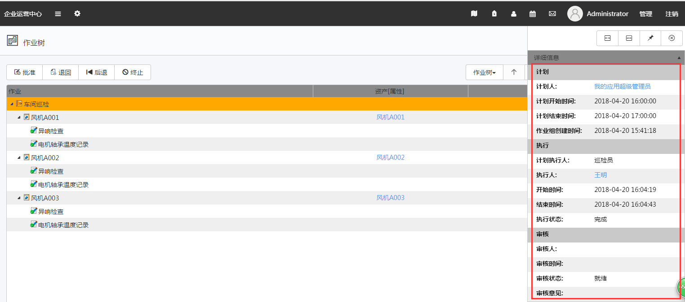
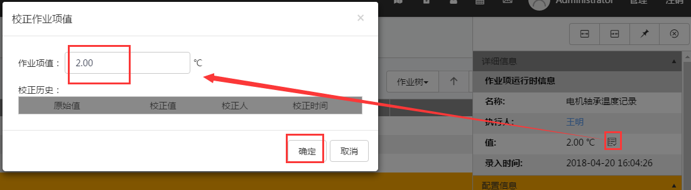
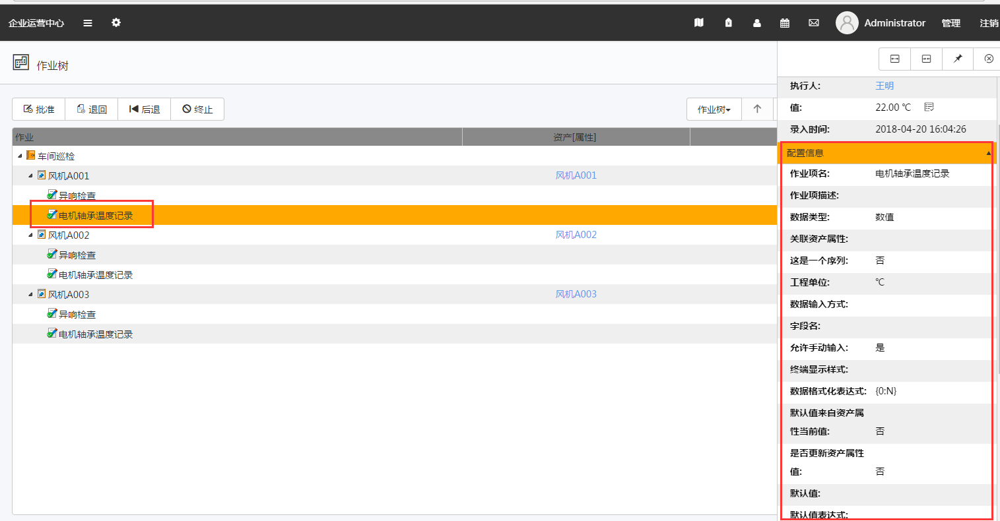
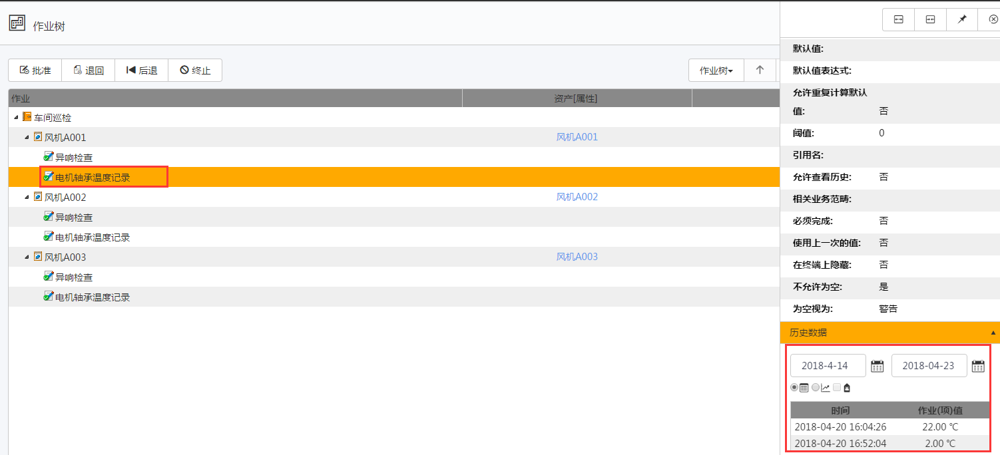

# 详细视图
作业树视图的右侧是详细视图，供用户查看该作业组有关的所有详细信息。

详细信息包括三个内容：

## 详细信息
在左边作业树界面选中作业或作业项，右边详细信息栏将出现对应的详细信息。

值校正

单击图标，进入校正作业值界面，如图：

修改**作业值**，完成后单击**保存**。

## 配置信息
相应选中项目的配置信息，此信息为使用im解决方案开发中心配置该解决方案时的所有配置信息。

## 历史数据
查看作业或者作业项的相关历史数据。对于数值类型，支持曲线方式展现。

## 审核内容生成日志
用户在审核页面可以对完成的作业组进行审核，并添加审核意见，勾选**同时发布一条日志**可以将审核意见同时生成并发布成为一条日志，在日志页面与其他用户分享。