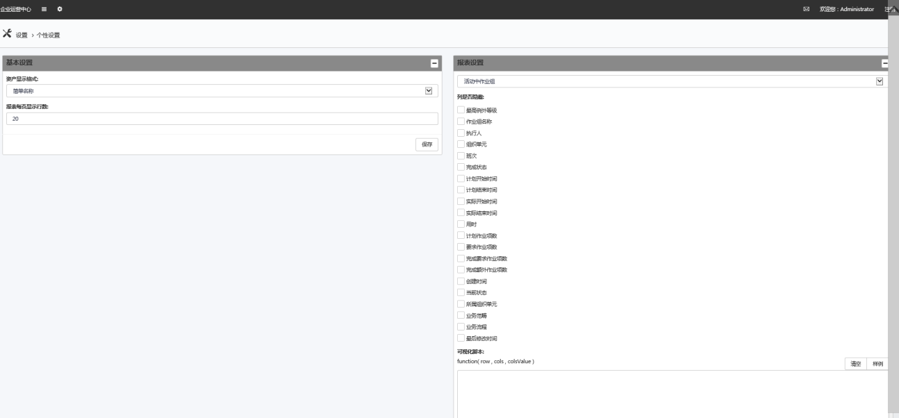

## 个性设置

* 在**个性设置**中，用户可以设置自己的缺省首页以及报表模块中每页显示的行数，以适应用户自己的需求

* **资产显示设置**：提供简单名称和复合名称两种类型。
* **报表设置**：可设置每页显示的行数以及各个状态下可以隐藏的列。
  * 每页显示行数：缺省为每页20行，可以根据需要增加或减少，一定数量以后会以滚动条形式增加行数。
  * 报表类型隐藏列：设置报表视图的显示列，选择相应的报表类型，勾选需要隐藏的列，则在报表视图中不显示这列。