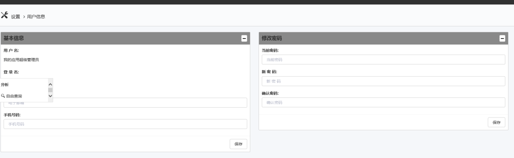

# 设置
设置页面是提供用户查看和管理自己的相关信息，具体分为：用户信息，个性设置用户可以在**修改密码页面**修改自己的密码。

* 在**个性设置**中，用户可以设置自己的缺省首页以及报表模块中每页显示的行数，以适应用户自己的需求

## 用户信息

用户可以在**管理-修改密码**中修改自己的密码。密码为登录imgenius系统各个模块的密码，修改完成后单击保存。

注意：用户分别可以在SDC-用户、手持终端-工具-个性化、及EOC-管理中修改密码。